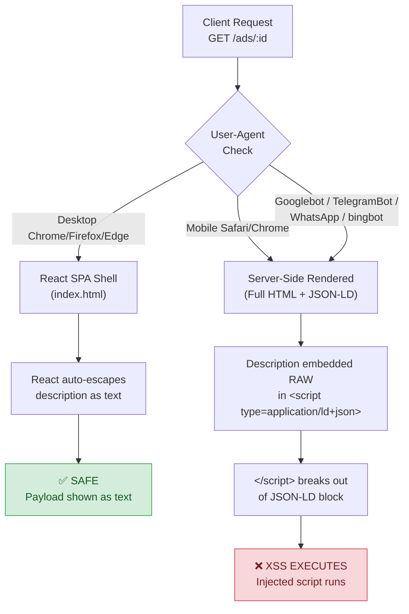

# 🔬 Mobile SSR JSON-LD Stored XSS Lab

[](https://www.docker.com/)
[](https://nodejs.org/)
[](LICENSE)
[]()

An intentionally vulnerable, Dockerized training lab that reproduces a **Stored XSS** caused by a rendering discrepancy between a React SPA (safe) and Server-Side Rendered pages served to mobile browsers and crawlers (vulnerable).

> [!CAUTION]
> This application is **intentionally vulnerable**. Run it only on your own machine. Docker Compose binds it to `127.0.0.1` by default; **do not expose it to the internet or a shared network**.

## Architecture



## The Vulnerability

The core issue is a **JSON-LD injection** in server-side rendered pages:

1. **Storage is raw** — The ad description is stored verbatim. No sanitization.
2. **JSON-LD serialization is unsafe** — `JSON.stringify()` produces valid JSON, but it does **not** escape `<`, `>`, or `&`. These characters are harmless in JSON but lethal inside an HTML `<script>` element.
3. **`</script>` breaks out** — The HTML parser recognizes a literal `</script>` even inside a `<script type="application/ld+json">` block and closes the element.
4. **CSP allows inline scripts** — The `script-src 'unsafe-inline'` policy means injected `<script>` tags execute without needing a nonce or hash.
5. **No `Vary: User-Agent`** — The server omits this header, so shared caches (CDN, corporate proxy) may serve the vulnerable SSR variant to desktop clients too.

### Which render path is vulnerable?

| Surface | Render | Escaping | Result |
|---|---|---|---|
| Desktop Chrome/Firefox/Edge | React SPA | React auto-escape | ✅ Safe |
| Mobile Safari/Chrome | SSR → JSON-LD `<script>` | **None** (raw) | ❌ **Vulnerable** |
| Googlebot, bingbot | SSR → JSON-LD `<script>` | **None** (raw) | ❌ **Vulnerable** |
| TelegramBot, WhatsApp, Discordbot | SSR → JSON-LD `<script>` | **None** (raw) | ❌ **Vulnerable** |

## Quick Start with Docker

```bash
docker compose up --build
```

Open [http://localhost:3000](http://localhost:3000), create an ad, and use this proof payload in the **description**:

```html
</script>
```

### Test the two render paths

On a normal desktop browser, open the ad. The payload appears as **text** — React escapes it. Safe.

Then switch your browser's User-Agent to mobile (F12 → Network Conditions → User Agent) and reload. The server returns SSR, the JSON-LD block is terminated early, and `alert()` fires.

You can also compare directly with curl:

```bash
# Desktop: safe React shell — the stored payload is NOT in the HTML.
curl -s http://localhost:3000/ads/AD_ID \
  -A "Mozilla/5.0 (Windows NT 10.0; Win64; x64) Chrome/140"

# Mobile: vulnerable SSR — the raw payload is embedded in JSON-LD.
curl -s http://localhost:3000/ads/AD_ID \
  -A "Mozilla/5.0 (iPhone; CPU iPhone OS 18_0 like Mac OS X) Mobile/15E148"

# Googlebot: also gets the vulnerable SSR.
curl -s http://localhost:3000/ads/AD_ID \
  -A "Googlebot/2.1"
```

Stop with `docker compose down`. Remove stored ads: `docker compose down -v`.

## Local Development

Requires Node.js 20+.

```bash
npm install
npm run dev
```

Vite runs on port 5173, proxying API routes to Express on port 3000. For production mode:

```bash
npm run build
npm start
```

## Tests

```bash
npm test
```

The test suite verifies:
- ✅ Input validation (incomplete ads, oversized fields)
- ✅ Data persistence across app restarts
- ✅ Desktop UA → safe React SPA shell
- ✅ Mobile UA → vulnerable SSR with raw JSON-LD
- ✅ Crawler UAs (Googlebot, TelegramBot, WhatsApp) → vulnerable SSR
- ✅ CSP `unsafe-inline` present on SSR responses
- ✅ `Vary: User-Agent` intentionally absent (cache poisoning defect)
- ✅ og:title / og:description meta tags present

## How the Fix Would Work

The vulnerable line is isolated in [`server/ssr.js`](server/ssr.js) and clearly marked.

**Correct approach:** Escape `<`, `>`, and `&` after JSON serialization before embedding in `<script>`:

```javascript
// SAFE: escapes HTML-significant characters in JSON output
function safeJsonString(value) {
  return JSON.stringify(value).replace(/[<>&]/g, (ch) => ({
    "<": "\\u003c",
    ">": "\\u003e",
    "&": "\\u0026"
  })[ch]);
}
```

The `title` and `category` fields already use this function — only `description` retains the vulnerable `JSON.stringify()` for the lab's educational purpose.

**Defense in depth:**
- Remove `'unsafe-inline'` from CSP and use nonces/hashes
- Add `Vary: User-Agent` to prevent cache poisoning
- Apply server-side input validation (block `<`, `>`, `"` in descriptions)

## Project Structure

```
├── server/
│   ├── app.js          # Express routes, UA-based routing, CSP
│   ├── ssr.js          # SSR renderer with VULNERABLE JSON-LD serializer
│   ├── storage.js      # JSON file-based ad storage
│   └── index.js        # Server entry point
├── src/
│   ├── App.jsx         # React SPA (safe render path)
│   ├── styles.css      # SPA styles
│   └── main.jsx        # React entry point
├── public/
│   └── ssr.css         # SSR page styles
├── test/
│   └── lab.test.js     # Automated test suite
├── Dockerfile          # Multi-stage production build
├── compose.yaml        # Docker Compose config (binds to 127.0.0.1)
└── README.md
```

## Scope

This lab models **only** the stored XSS mechanics described above. It has no authentication, privileged APIs, CORS misconfiguration, or real account data. The proof payload changes a local DOM attribute and shows an alert; it does not transmit data.

## License

MIT
