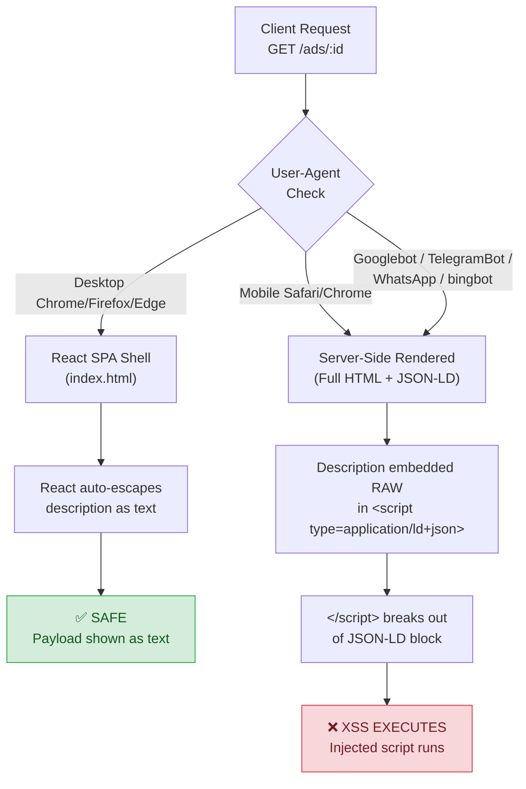

# 🔬 Mobile SSR JSON-LD Stored XSS Lab

[](https://www.docker.com/)
[](https://nodejs.org/)
[](LICENSE)
[]()

An intentionally vulnerable, Dockerized training lab that reproduces a **Stored XSS** caused by a rendering discrepancy between a React SPA (safe) and Server-Side Rendered pages served to mobile browsers and crawlers (vulnerable).

> [!CAUTION]
> This application is **intentionally vulnerable**. Run it only on your own machine. Docker Compose binds it to `127.0.0.1` by default; **do not expose it to the internet or a shared network**.

## Architecture



## The Vulnerability

The core issue is a **JSON-LD injection** in server-side rendered pages:

1. **Storage is raw** — The ad description is stored verbatim. No sanitization.
2. **JSON-LD serialization is unsafe** — `JSON.stringify()` produces valid JSON, but it does **not** escape `<`, `>`, or `&`. These characters are harmless in JSON but lethal inside an HTML `<script>` element.
3. **`</script>` breaks out** — The HTML parser recognizes a literal `</script>` even inside a `<script type="application/ld+json">` block and closes the element.
4. **CSP allows inline scripts** — The `script-src 'unsafe-inline'` policy means injected `<script>` tags execute without needing a nonce or hash.
5. **No `Vary: User-Agent`** — The server omits this header, so shared caches (CDN, corporate proxy) may serve the vulnerable SSR variant to desktop clients too.

### Which render path is vulnerable?

| Surface | Render | Escaping | Result |
|---|---|---|---|
| Desktop Chrome/Firefox/Edge | React SPA | React auto-escape | ✅ Safe |
| Mobile Safari/Chrome | SSR → JSON-LD `<script>` | **None** (raw) | ❌ **Vulnerable** |
| Googlebot, bingbot | SSR → JSON-LD `<script>` | **None** (raw) | ❌ **Vulnerable** |
| TelegramBot, WhatsApp, Discordbot | SSR → JSON-LD `<script>` | **None** (raw) | ❌ **Vulnerable** |

## 🚀 Lab Setup & Installation

You can run this lab either using **Docker** (recommended for isolation and matching the original SSR environment) or directly with **Node.js**.

### Prerequisites

* **Docker Option**: [Docker Desktop](https://www.docker.com/products/docker-desktop/) or Docker Engine with the Docker Compose plugin.
* **Local Node Option**: [Node.js](https://nodejs.org/) v20.x or higher, and `npm` v10.x+.

---

### Method 1: Docker (Recommended)

This method packages the Express SSR backend and compiled React SPA in an isolated Alpine container binding safely to `127.0.0.1:3000`.

1. **Clone the repository**:
   ```bash
   git clone https://github.com/maverick0o0/stored-xss-mobile-ssr-lab.git
   cd stored-xss-mobile-ssr-lab
   ```

2. **Build and start the container**:
   ```bash
   docker compose up --build -d
   ```

3. **Verify the container is healthy**:
   ```bash
   curl -s http://localhost:3000/health
   # Expected output: {"status":"ok"}
   ```

4. **Access the application**:
   Open your browser at [**http://localhost:3000**](http://localhost:3000).

5. **Stopping and resetting the lab**:
   ```bash
   # Stop the container
   docker compose down

   # Stop and completely erase all stored ads (resets the database)
   docker compose down -v
   ```

---

### Method 2: Local Development (Node.js)

If you prefer running directly on your host machine without Docker:

1. **Clone and install dependencies**:
   ```bash
   git clone https://github.com/maverick0o0/stored-xss-mobile-ssr-lab.git
   cd stored-xss-mobile-ssr-lab
   npm install
   ```

2. **Development Mode (Vite HMR + Backend)**:
   ```bash
   npm run dev
   ```
   * Vite dev server will start on [**http://localhost:5173**](http://localhost:5173) and automatically proxy API requests to Express on port `3000`.

3. **Production Mode (Single Port 3000)**:
   ```bash
   # 1. Build client SPA assets
   npm run build

   # 2. Start the Express server
   npm start
   ```
   * Open [**http://localhost:3000**](http://localhost:3000).

---

## 🧪 Testing the Vulnerability

Once the lab is running on [http://localhost:3000](http://localhost:3000):

### 1. Create an Ad with an XSS Payload
In the form, fill in a title and category, then insert one of the proof payloads into the **description**:

* **Recommended (Direct `<script>` tag breakout):**
  ```html
  </script><script>alert('Stored XSS via JSON-LD breakout')</script>
  ```
* **Alternative (`` onerror without double quotes):**
  ```html
  </script>
  ```

> [!IMPORTANT]
> **Why do double quotes (`"`) fail in attribute payloads?**
> The server serializes the JSON-LD with `JSON.stringify(ad.description)`. If you submit double quotes (e.g. `onerror="..."`), `JSON.stringify` escapes them to `\"`. In the rendered HTML this becomes `onerror=\"...\"`. In HTML5 parsing, the backslash is not an escape character for quotes, so the attribute value becomes literal `\"...\"`. When evaluated by the JS engine, this causes an unhandled `SyntaxError: Invalid or unexpected token`. Always use `<script>` tags, single quotes (`'`), or unquoted values.

### 2. Verify the Two Render Paths

* **Desktop User-Agent (Safe)**:
  Open the ad detail page in a standard browser. React client-side rendering auto-escapes the description. The payload is rendered harmlessly as plain text.

* **Mobile User-Agent (Vulnerable SSR)**:
  1. Open Chrome DevTools (`F12`).
  2. Click the three dots menu (top-right of DevTools) → **More tools** → **Network conditions**.
  3. Under **User agent**, uncheck *"Use browser default"* and select a mobile device (e.g., **Chrome — Android Mobile** or **Safari — iPhone iOS**).
  4. Reload the page (`F5` or `Ctrl+R`).
  5. The server serves the SSR variant with raw JSON-LD reflection, the `</script>` tag breaks out, and the `alert()` executes immediately.

* **Compare directly via CLI (`curl`)**:
  ```bash
  # Desktop UA: gets safe SPA shell (payload is NOT in the HTML)
  curl -s http://localhost:3000/ads/YOUR_AD_ID \
    -A "Mozilla/5.0 (Windows NT 10.0; Win64; x64) Chrome/140"

  # Mobile UA: gets vulnerable SSR (raw payload is embedded in JSON-LD)
  curl -s http://localhost:3000/ads/YOUR_AD_ID \
    -A "Mozilla/5.0 (iPhone; CPU iPhone OS 18_0 like Mac OS X) Mobile/15E148"

  # Googlebot UA: also receives the vulnerable SSR page
  curl -s http://localhost:3000/ads/YOUR_AD_ID \
    -A "Googlebot/2.1"
  ```

---

## 🔧 Troubleshooting & Tips

| Issue | Cause | Solution |
|---|---|---|
| **Port 3000 already in use** | Another service is using port 3000 | In `compose.yaml`, change `"127.0.0.1:3000:3000"` to `"127.0.0.1:8080:3000"`, or set `PORT=8080 npm start`. |
| **Alert popup does not appear on reload** | DevTools cache or desktop UA still active | Ensure "Network conditions" has mobile UA selected and refresh with `Ctrl+Shift+R` / `F5`. Ensure your payload begins with `</script>`. |
| **Reset all created ads** | Need a clean state | Run `docker compose down -v` or delete `data/ads.json`. |
| **Docker daemon not running** | Docker Desktop is closed | Start Docker Desktop or verify Docker service with `docker info`. |

## Tests

```bash
npm test
```

The test suite verifies:
- ✅ Input validation (incomplete ads, oversized fields)
- ✅ Data persistence across app restarts
- ✅ Desktop UA → safe React SPA shell
- ✅ Mobile UA → vulnerable SSR with raw JSON-LD
- ✅ Crawler UAs (Googlebot, TelegramBot, WhatsApp) → vulnerable SSR
- ✅ CSP `unsafe-inline` present on SSR responses
- ✅ `Vary: User-Agent` intentionally absent (cache poisoning defect)
- ✅ og:title / og:description meta tags present

## How the Fix Would Work

The vulnerable line is isolated in [`server/ssr.js`](server/ssr.js) and clearly marked.

**Correct approach:** Escape `<`, `>`, and `&` after JSON serialization before embedding in `<script>`:

```javascript
// SAFE: escapes HTML-significant characters in JSON output
function safeJsonString(value) {
  return JSON.stringify(value).replace(/[<>&]/g, (ch) => ({
    "<": "\\u003c",
    ">": "\\u003e",
    "&": "\\u0026"
  })[ch]);
}
```

The `title` and `category` fields already use this function — only `description` retains the vulnerable `JSON.stringify()` for the lab's educational purpose.

**Defense in depth:**
- Remove `'unsafe-inline'` from CSP and use nonces/hashes
- Add `Vary: User-Agent` to prevent cache poisoning
- Apply server-side input validation (block `<`, `>`, `"` in descriptions)

## Project Structure

```
├── server/
│   ├── app.js          # Express routes, UA-based routing, CSP
│   ├── ssr.js          # SSR renderer with VULNERABLE JSON-LD serializer
│   ├── storage.js      # JSON file-based ad storage
│   └── index.js        # Server entry point
├── src/
│   ├── App.jsx         # React SPA (safe render path)
│   ├── styles.css      # SPA styles
│   └── main.jsx        # React entry point
├── public/
│   └── ssr.css         # SSR page styles
├── test/
│   └── lab.test.js     # Automated test suite
├── Dockerfile          # Multi-stage production build
├── compose.yaml        # Docker Compose config (binds to 127.0.0.1)
└── README.md
```

## Scope

This lab models **only** the stored XSS mechanics described above. It has no authentication, privileged APIs, CORS misconfiguration, or real account data. The proof payload changes a local DOM attribute and shows an alert; it does not transmit data.

## License

MIT
